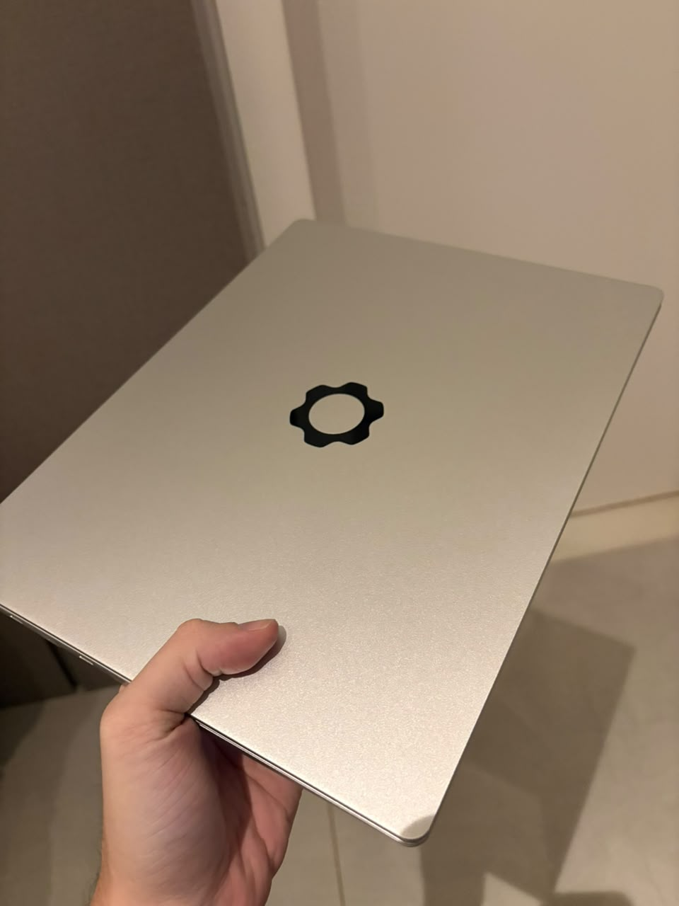
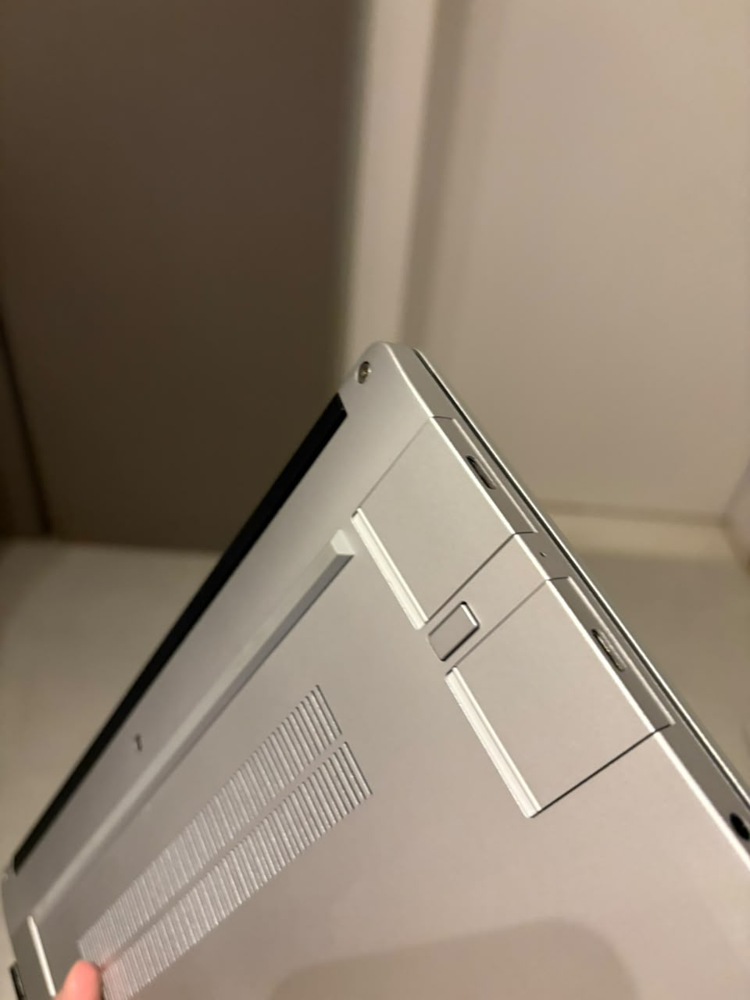
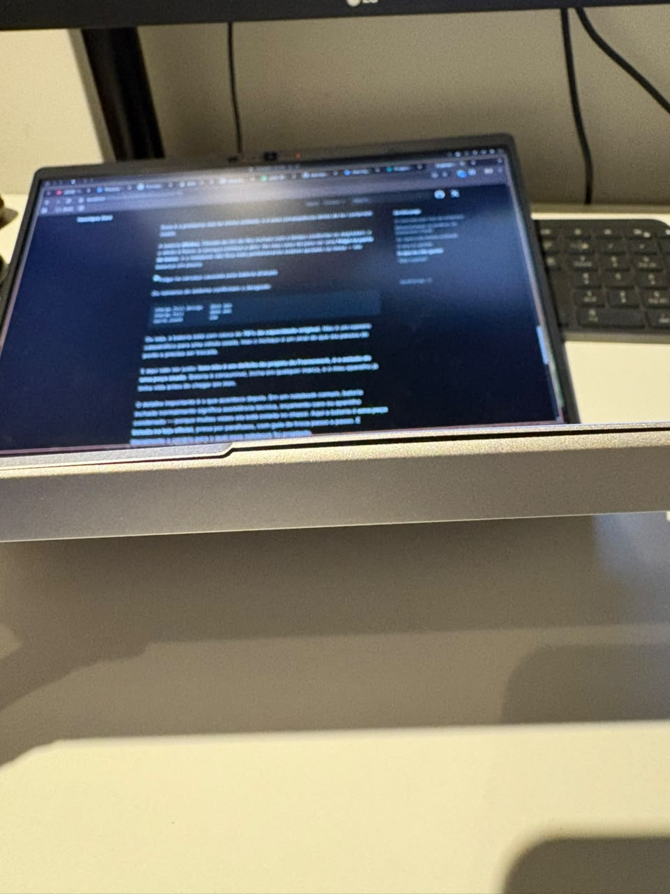

Depois de quase dois meses usando um **Framework Laptop 13** como máquina principal, acho que já dá para escrever algo honesto sobre ele. E tem um detalhe que muda bastante a perspectiva dessa review: **eu comprei usado**. Isso me deu acesso a um notebook que eu provavelmente não compraria novo, mas também me entregou junto alguns problemas que um aparelho de primeira mão não teria.



## O conceito por trás da empresa

A **Framework** é uma empresa relativamente nova, fundada em 2019, e ela nasceu com uma proposta que soa quase provocativa para o mercado de notebooks: **e se um laptop fosse feito para durar e ser consertado?**

Parece óbvio, mas não é o que a indústria vem fazendo. Nos últimos anos a tendência foi exatamente a oposta: memória soldada na placa, SSD soldado, bateria colada com adesivo, parafusos proprietários e manuais de serviço que simplesmente não existem. O resultado é um aparelho que, quando um componente falha, vira lixo eletrônico inteiro.

A Framework inverteu essa lógica. O notebook vem com **uma chave de fenda na caixa**. Cada peça tem um QR code que leva direto para o guia de reparo oficial. A loja da empresa vende praticamente **qualquer componente avulso**: tela, teclado, dobradiças, alto-falantes, placa-mãe, bezel, tampa traseira. Se você quebrar a tela, você compra a tela e troca sozinho em alguns minutos, sem assistência técnica e sem perder garantia.

E não para na reparabilidade. A parte mais interessante é o **upgrade**. A mesma carcaça que eu tenho aqui aceita placas-mãe de gerações diferentes: dá para comprar hoje um modelo Ryzen e daqui a alguns anos trocar só a placa por uma geração mais nova, aproveitando tela, teclado, bateria e chassi. A placa antiga ainda pode virar um mini PC com um case impresso em 3D. É um conceito de **plataforma**, não de produto descartável.

## Modularidade na prática: os Expansion Cards

O recurso mais visível dessa filosofia são os **Expansion Cards**. Em vez de portas fixas soldadas na lateral, o Framework 13 tem **quatro slots** que aceitam cartõezinhos intercambiáveis. Você escolhe quais portas o seu notebook tem — e muda quando quiser.

Existem cartões de USB-C, USB-A, HDMI, DisplayPort, Ethernet, leitor de microSD e até de armazenamento extra. Trocar é literalmente empurrar uma trava e puxar o cartão, com a máquina ligada.



Na prática isso resolve um problema real e chato: eu não preciso mais andar com dongle. Quando vou para um lugar onde sei que existe projetor, coloco o HDMI. No dia a dia, deixo mais USB-C. É o tipo de coisa que parece um detalhe bobo na hora de comprar e que vira um conforto enorme depois.

Tem um porém honesto aqui: os cartões ocupam o espaço interno e alguns modelos consomem energia mesmo ociosos, então não é algo totalmente "de graça". Mas o ganho de flexibilidade compensa com folga.

## As specs da minha unidade

A minha é a versão **AMD Ryzen 7040 Series**:

| Componente | Especificação |
| --- | --- |
| Modelo | Framework Laptop 13 (AMD Ryzen 7040 Series) |
| Processador | AMD Ryzen 7 7840U (8 núcleos / 16 threads) |
| Gráficos | Radeon 780M integrada |
| Memória | 96 GB DDR5 (SO-DIMM, substituível) |
| Armazenamento | NVMe Kingston SNV3S de 1 TB |
| Tela | 13.5" 2256x1504, proporção 3:2 |
| Wi-Fi | MediaTek MT7922 (Wi-Fi 6E) |
| Bateria | 61 Wh |
| Sistema | Omarchy (Arch Linux), kernel 7.1 |

Vale reforçar o que a tabela mostra de forma discreta: **memória e SSD são peças normais, compradas em qualquer lugar**. Os 96 GB de RAM já vieram na compra — o dono anterior tinha feito o upgrade, porque simplesmente dá para fazer. Em um notebook com memória soldada, essa configuração custaria uma fortuna ou nem existiria, e certamente não teria sobrevivido à revenda.

## O que eu gostei

<b> A integração com Linux é excelente </b>

Esse foi o ponto que mais me surpreendeu positivamente. A Framework trata Linux como **cidadão de primeira classe**, não como um sistema tolerado. A empresa mantém guias oficiais de instalação para várias distros, participa ativamente das discussões de firmware e envia patches para o kernel.

O resultado é que **tudo funciona**, sem gambiarra:

- Suspender e acordar a máquina funciona de forma confiável, que historicamente é o calcanhar de Aquiles de notebook com Linux
- Teclas de função, brilho, volume e controle de teclado retroiluminado funcionam direto
- Wi-Fi e Bluetooth são reconhecidos sem firmware manual
- A GPU integrada tem driver aberto (`amdgpu`), então aceleração de vídeo e suporte a monitor externo funcionam sem dor de cabeça
- Atualização de BIOS pelo `fwupd`, sem precisar de pendrive ou Windows

Eu rodo **Omarchy**, que é uma distro baseada em Arch, e a instalação foi absolutamente sem evento. Isso é elogio: o melhor que se pode dizer de um hardware com Linux é que você esquece que ele existe e vai trabalhar.

<b> O teclado é muito gostoso de digitar </b>

Talvez seja a coisa que eu mais não esperava gostar tanto. O curso das teclas é maior do que a média dos notebooks finos de hoje, e o retorno é firme, sem aquela sensação de estar batendo direto na carcaça. Passo o dia escrevendo código e texto, e a diferença no fim do dia é real.

O layout também ajuda: as teclas têm tamanho decente, as setas não foram espremidas em meia altura e o touchpad não fica no caminho enquanto eu digito.

<b> É genuinamente portátil </b>

Com 13.5 polegadas e pouco mais de 1,3 kg, ele entra em qualquer mochila sem pesar. Mas o que realmente faz diferença no dia a dia é a **tela 3:2**. Depois de acostumar com essa proporção, voltar para um 16:9 é doloroso — em um monitor mais "quadrado" cabe muito mais código na vertical, muito mais linha de terminal, muito mais texto. Para quem programa, isso vale mais do que polegadas extras.

A resolução de 2256x1504 nesse tamanho também deixa o texto bem nítido, o que ajuda em sessões longas.

<b> Dá para abrir sem medo </b>

Abrir o notebook para conferir o que tinha dentro levou uns cinco minutos. Sem clipe de plástico para quebrar, sem adesivo, sem parafuso escondido embaixo do pé de borracha — são parafusos cativos comuns, que nem caem da tampa. É difícil descrever o quanto isso muda a relação com o aparelho: ele deixa de ser uma caixa preta e vira uma máquina que eu entendo.

## O que eu não gostei

<b> A bateria está inchada </b>

Esse é o problema real da minha unidade, e é uma consequência direta de ter comprado usado.

A bateria **dilatou**. Células de íon de lítio incham com o tempo conforme se degradam, e o efeito é físico: a carcaça começa a abrir. No meu caso dá para ver uma **folga na parte de baixo**, e o notebook não fica mais perfeitamente estável apoiado na mesa — ele balança um pouco.



Os números do sistema confirmam o desgaste:

```
charge_full_design   3915 mAh
charge_full          3065 mAh
cycle_count          159
```

Ou seja, a bateria está com cerca de **78% da capacidade original**. Não é um número catastrófico para uma célula usada, mas o inchaço é um sinal de que ela passou do ponto e precisa ser trocada.

E aqui vale ser justo: **isso não é um defeito de projeto do Framework, é o estado de uma peça usada**. Bateria é consumível, incha em qualquer marca, e o meu aparelho já tinha vida antes de chegar em mim.

O detalhe importante é o que acontece depois. Em um notebook comum, bateria inchada normalmente significa assistência técnica, orçamento caro ou aparelho condenado — porque muitas vezes ela está colada no chassi. Aqui a bateria é **uma peça listada na loja oficial**, presa por parafusos, com guia de troca passo a passo. É literalmente o cenário para o qual esse notebook foi projetado.

Ainda assim, é o ponto negativo mais concreto do meu uso hoje, e seria desonesto escrever uma review sem falar dele. Se você está considerando comprar um Framework usado, **peça para o vendedor mostrar o `charge_full` versus `charge_full_design` e uma foto da máquina apoiada em superfície plana**. Foi exatamente o que eu não fiz.

<b> O preço novo é difícil de justificar no Brasil </b>

Comprado de primeira mão e importado, o Framework não compete em custo-benefício puro com um notebook comum de specs equivalentes. Você está pagando um prêmio pela reparabilidade e pela promessa de upgrade futuro.

Para mim, comprar usado foi justamente o que fez a conta fechar — eu peguei o conceito por um preço razoável e assumi que ia precisar trocar a bateria em algum momento.

## Vale a pena?

Para mim, sim — e a bateria inchada, por mais irônico que pareça, acabou reforçando isso. É o primeiro notebook que eu tenho em que um problema físico não gera ansiedade, porque a solução é comprar a peça e trocar em vinte minutos.

Se você é o tipo de pessoa que gosta de abrir as coisas, que roda Linux e que se incomoda com a ideia de trocar um aparelho inteiro por causa de um componente, o Framework 13 entrega exatamente o que promete. Se você só quer um notebook que funcione e nunca vai encostar uma chave de fenda nele, provavelmente existem opções mais baratas que resolvem.

Daqui alguns meses pretendo escrever um follow-up, depois de trocar a bateria e com mais tempo de estrada. Por enquanto, a impressão é bem positiva.
